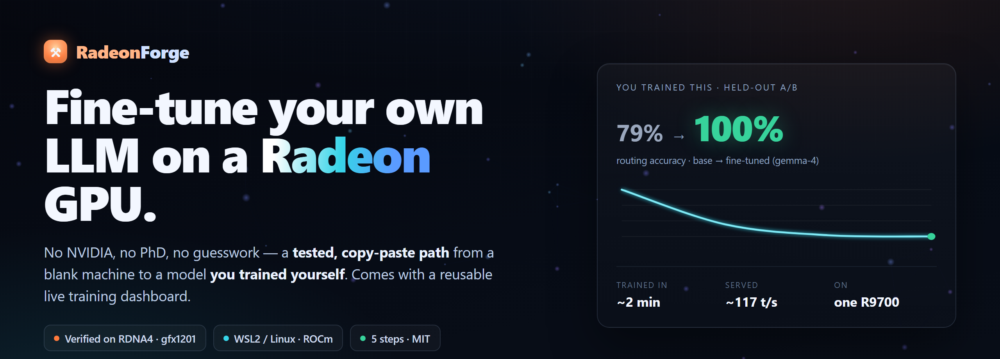
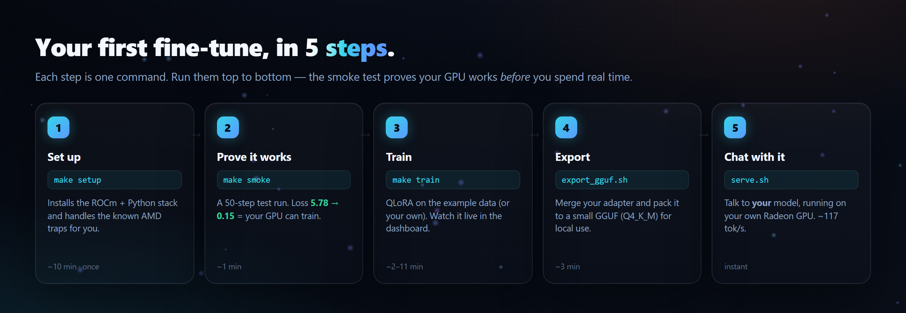
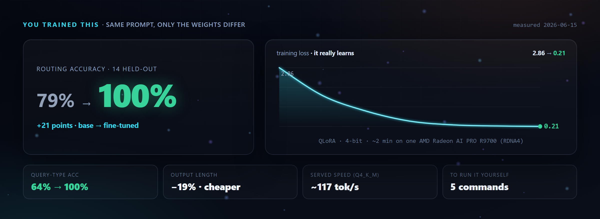
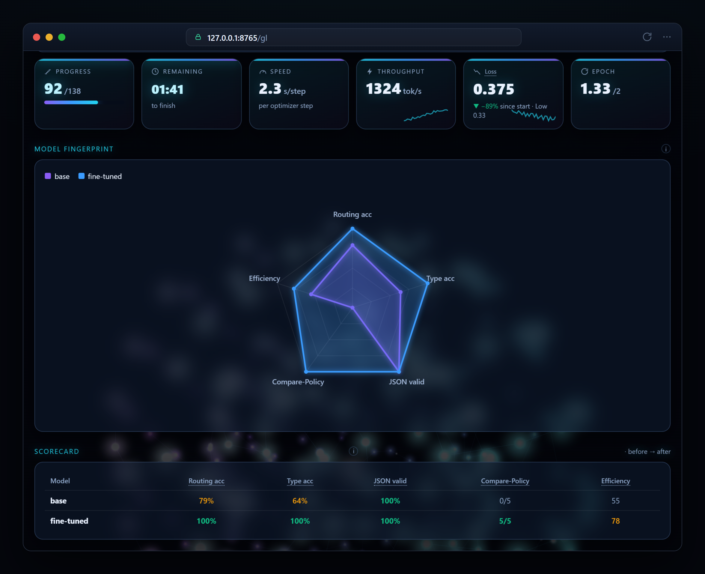
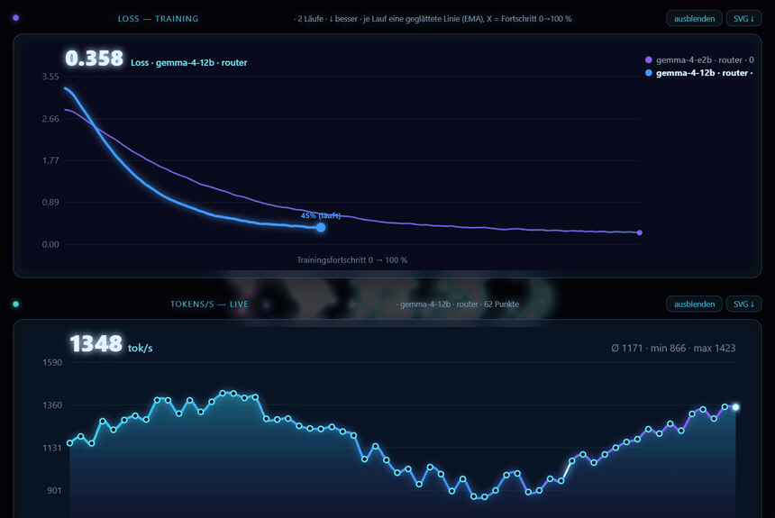
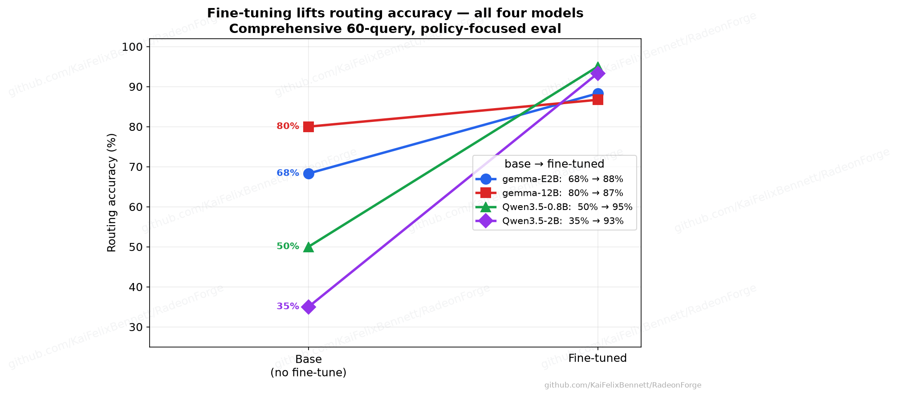
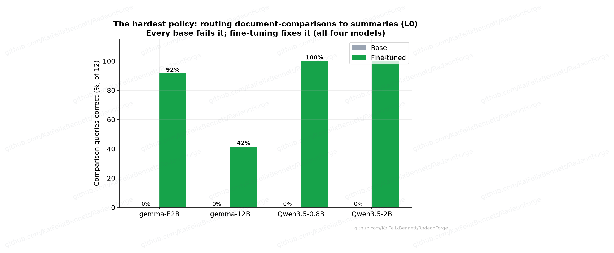
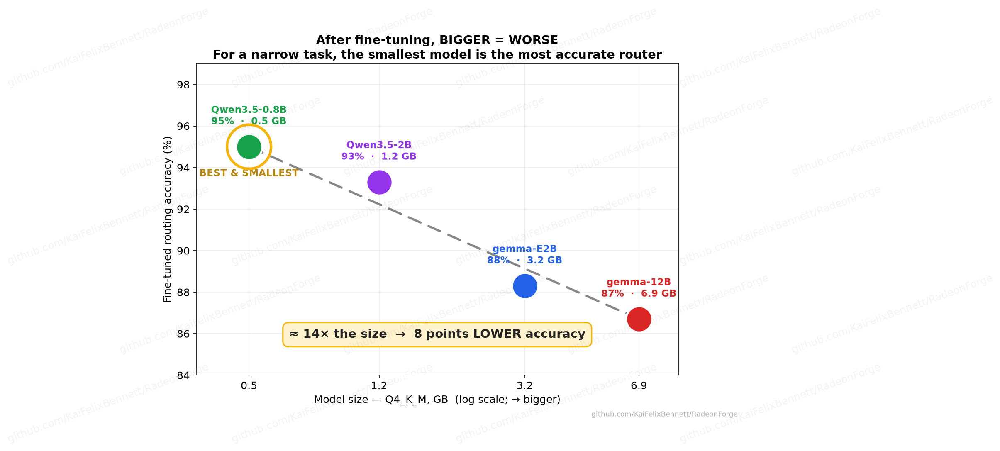
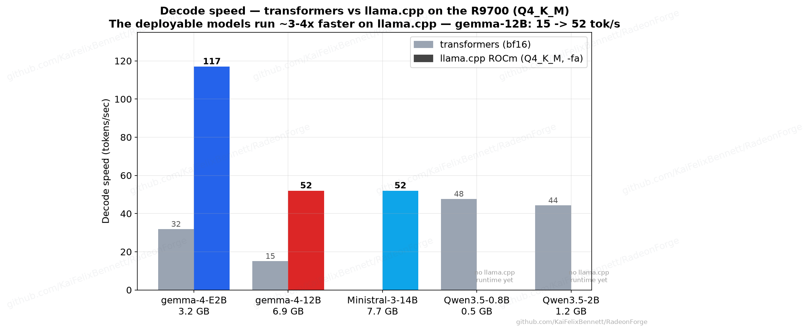

<div align="center">



<br>

[](VERSIONS.md)
[](docs/track-a-wsl2-rocm.md)
[](docs/paths-and-stability.md)
[](RUNBOOK.md)
[](LICENSE)
[](CONTRIBUTING.md)
[](https://github.com/KaiFelixBennett/RadeonForge/stargazers)

### Fine-tune your own LLM on an AMD Radeon GPU — the easy, tested way.

**No NVIDIA. No PhD. No guesswork.** A copy-paste path from a blank machine to a model *you trained yourself*, on the GPU you already own.

📖 [**Step-by-step (RUNBOOK)**](RUNBOOK.md) · 🔁 [**Use your own model**](docs/reuse-your-own-model.md) · 🧠 [**Never trained before? Start here**](docs/how-finetuning-works.md) · 🩺 [**If something breaks**](docs/troubleshooting.md)

</div>

> ### You get two real, reusable things — both yours to keep
>
> **① A tested path to train your own model on Radeon** — 5 plain commands, with a smoke test that proves your GPU can train *before* you spend real time on it.
>
> **② A production-quality live training dashboard** — *one* stdlib Python file you point at **your** run. Not a screenshot mocked up for this page; a tool you actually run, reusable in any project.

---

## 💡 Why fine-tune at all? (the payoff)

You don't *always* need to — a good prompt goes far. But when you want a model to do **your**
task **reliably**, fine-tuning pays off in ways prompting can't:

- **It bakes the behaviour into the weights.** Stop fighting the model with ever-longer system
  prompts — teach it once and it just *does* the thing (your format, your tone, your rules).
- **Small + local beats big + cloud for a narrow task.** In our own example a **0.5 GB**
  fine-tuned router scored **95%** — *higher* than a 6.9 GB general model (87%) — and runs on the
  GPU you already own at ~117 tok/s. Cheaper per call, faster, and it fits in VRAM.
- **You own it.** No per-token API bills, no rate limits, no data leaving your machine. It runs
  **offline**, on your hardware — real data sovereignty.
- **Consistency.** Predictable structure (valid JSON every time) and shorter outputs (**−19%** in
  our example → cheaper and faster on every single call).

> **Honest caveat:** fine-tuning teaches *behaviour, format and style* — not fresh facts. For
> up-to-date or private knowledge, pair a fine-tune with retrieval (RAG); they're complementary,
> not either/or.

---

## 🛠️ Train your own model — 5 commands

Fine-tuning has a reputation for being hard. On AMD it has a reputation for being *impossible*.
Neither is true anymore. Here's the whole path — each step is **one command**, and step 2
proves your GPU can train **before** you spend real time on it.

<div align="center">



</div>

```bash
git clone https://github.com/KaiFelixBennett/RadeonForge && cd RadeonForge
```

| # | Command | What it does | You'll see |
|---|---|---|---|
| **1** | `make setup` | Installs the ROCm + Python stack and **handles the known AMD traps for you** (the librocdxg bridge, the bitsandbytes & Triton install order). Run once, inside WSL2. | a green environment check |
| **2** | `make smoke` | A 50-step test run on a tiny model. This is the honest part: it **fails loudly** if your box *can't* train, so you never waste an hour. | `loss 5.78 → 0.15  ✓ this box can train` |
| **3** | `make train` | QLoRA fine-tunes the example model on the example data ([make your own](docs/training-data-101.md)). Watch it **live** in the dashboard. | the loss falling, in real time |
| **4** | `bash examples/gemma4-12b-qlora/export_gguf.sh` | Merges your adapter and packs it into a small **GGUF (Q4_K_M)** so it runs locally. | `23.8 GB → 6.9 GB` |
| **5** | `bash examples/gemma4-12b-qlora/serve.sh` | Serves **your** model on your own Radeon GPU, OpenAI-compatible. | a model you can chat with, ~117 tok/s |

<details>
<summary><b>▶ Watch the whole run (animated)</b></summary>

<div align="center"></div>
</details>

> **New to all of this?** [docs/how-finetuning-works.md](docs/how-finetuning-works.md) explains
> *why* each step exists, in plain language — no prior fine-tuning experience assumed. The full
> walkthrough from a blank Ubuntu is the [**RUNBOOK**](RUNBOOK.md).

No `make`? Every step is a single command — see the [Makefile](Makefile). On Windows the
training steps run inside WSL2; the dashboard runs anywhere.

### 🧩 Step 3, deeper: bring your own data

Step 3 trains on the example data. To teach the model *your* task, you need a handful of
`(input → ideal answer)` examples. [`scripts/make_dataset.py`](scripts/make_dataset.py) gets you
there **three ways**, and always opens a **review page** so you can eyeball the labels first
(the one rule that matters most). See it in 10 seconds with the offline teacher — no model, no key:

```bash
make data        # drafts a sample set + opens the keep/drop/edit review page in your browser
```

| You have… | Use | What happens |
|---|---|---|
| just an idea | `make_dataset.py generate --task "…"` | a **teacher** model drafts N diverse examples |
| a list of inputs | `make_dataset.py label --inputs q.txt` | a teacher writes the ideal answer for each |
| existing pairs (CSV/JSONL) | `make_dataset.py convert --in pairs.csv` | reformatted to chat-JSONL — **no teacher needed** |

The teacher is **pluggable** — run it **locally on your Radeon** via [Ollama](https://ollama.com)
(free, private) or use a cloud API (`--provider ollama|anthropic|openai`). New to *teacher vs.
student* and how data must look? → [**docs/training-data-101.md**](docs/training-data-101.md).

---

## 📊 You trained this — and here's the proof

A falling loss is necessary but not enough, so RadeonForge always does a **controlled A/B**:
the *same* held-out prompts through the untouched base model and the one you just trained.
Here's the worked example (a query-router), measured on **one** AMD Radeon AI PRO R9700:

<div align="center">



</div>

| | Before (base) | After (you trained it) |
|---|---|---|
| **Routing accuracy** (14 held-out) | 79 % | **100 %** |
| Query-type accuracy | 64 % | **100 %** |
| Avg output length | 88 tok | **71 tok (−19 %)** |
| Served speed (Q4_K_M, R9700) | — | **~117 tok/s** |

Every number is regenerated from raw A/B JSON by [`make charts`](examples/gemma4-12b-qlora/make_charts.py)
— nothing is hand-typed. It also **scales to the 12B** on the same card (~11 min to train,
6.9 GB Q4_K_M, ~53 tok/s, 86 % → 93 %). Full evidence: [**PILOT_REPORT.md**](PILOT_REPORT.md).

---

## 🖥️ A real, reusable dashboard — not a README mockup

The charts above aren't vibe-coded for this page. The dashboard is **one stdlib Python file**
(`scripts/progress_dashboard.py`) that simply reads the plain JSON your training writes — point
it at *your* run and it lights up: live loss & tokens/s, a base-vs-fine-tuned radar fingerprint,
a pass/fail eval grid, GPU telemetry, and a data-driven roadmap. **Zero dependencies. Works
offline.**

<div align="center">



</div>

Wiring it to **your own** training is two lines — copy nothing, just point it at your files:

```yaml
# 1) add one line to your training config
progress_file: ./_runs/my-run.json
```
```bash
# 2) while it trains, watch it live
python scripts/progress_dashboard.py --runs-dir ./_runs --open
```

Reuse it in any project by pointing `--runs-dir` / `--data-dir` / `--tracks` at your paths. Full
schemas + the drop-in recipe: [scripts/DASHBOARD.md](scripts/DASHBOARD.md) ·
[docs/reuse-your-own-model.md](docs/reuse-your-own-model.md).

<details>
<summary>▶ Watch it update live · or preview it without a GPU</summary>

<div align="center"></div>

No Radeon set up yet? The dashboard can stand in a simulated run so you can explore the whole UI
first — `python scripts/demo_dashboard.py --open` — then point it at your real training.
</details>

---

## 🤔 Why this exists

Fine-tuning an LLM on an **AMD consumer/workstation GPU under Windows** is, as of 2026, still a
yak-shave. Official AMD tutorials assume datacenter Instinct (MI300X) on Linux; consumer
**RDNA** is "supported" at the runtime layer, but the *training* stack (bitsandbytes,
FlashAttention, paged optimizers) breaks in undocumented, arch-specific ways. The knowledge that
makes it work is scattered across forum posts, GitHub issues, and one-off blogs — which is
exactly why so many Radeon owners believe training "doesn't work on AMD." It does.

RadeonForge packages **one pinned, tested path** for the intersection that is genuinely unmet:

> **discrete RDNA4 (RX 9070 / Radeon AI PRO R9700, `gfx1201`) + Windows/WSL2 + reproducible QLoRA/LoRA + a worked Gemma-4 example + a smoke test.**

It's deliberately *not* "yet another ROCm wrapper" — the general case (Linux/Instinct, or APUs)
is already covered by [Unsloth](https://unsloth.ai),
[LLaMA-Factory](https://github.com/hiyouga/LLaMA-Factory), and
[kyuz0/amd-strix-halo-llm-finetuning](https://github.com/kyuz0/amd-strix-halo-llm-finetuning).
The value here is the **Windows/WSL2 + discrete-RDNA4 glue** and the **honest, dated workarounds**.

---

## 🧭 Will it work on my card? (the honest matrix, June 2026)

We'd rather be trusted than impressive, so here's the unvarnished version:

| Platform | Inference | **Training (fine-tune)** |
|---|---|---|
| **Native Windows + ROCm** | ✅ preview | ❌ **No ML training** (AMD: *"No ML training support"*) |
| **Native Windows + Vulkan** | ✅ (often fastest on RDNA4) | ❌ no backward-pass kernel upstream |
| **WSL2 + ROCm** | ✅ | ✅ **QLoRA/LoRA** — start here on Windows |
| **Native Linux + ROCm** | ✅ | ✅ **most stable — long-term home** |

- **Verified:** AMD Radeon AI PRO R9700 (RDNA4, `gfx1201`) — the numbers above are from this card.
- **Expected to work** (same `gfx1201`): RX 9070 / 9070 XT.
- **Expected with an arch-flag change**: RDNA3 (`gfx1100`, e.g. RX 7900 XTX) — *not yet tested*.

**Train on ROCm, not Vulkan.** On Windows → **WSL2 + ROCm** (you're likely 90 % there); for a
serious rig → **native Linux + ROCm**. Got it working on another card? A
[hardware report](../../issues/new/choose) is the single most useful thing you can contribute.
Full reasoning: [docs/paths-and-stability.md](docs/paths-and-stability.md).

---

## 🪤 The two AMD traps we already solved for you

Most "AMD can't train" horror stories come down to two silent failures on `gfx1201`. Both are
**baked into every config here**, and `make smoke` catches them in 60 seconds:

1. **Never use paged optimizers.** `paged_adamw_*` / `adamw_bnb_8bit` **silently corrupt**
   training (loss→0, grad_norm→NaN after step 1). We use `optim="adamw_torch"`. *(4-bit NF4 weight
   quant itself is fine — only the **paged** optimizer is broken.)*
2. **Use math SDPA attention.** FlashAttention doesn't compile for gfx1201, and AOTriton SDPA
   crashes during training. We disable both SDP backends and load with `attn_implementation="sdpa"`.

The full symptom → fix table is in [docs/troubleshooting.md](docs/troubleshooting.md).

---

## 🔁 Make it yours (your model, your data)

The whole stack is **project-agnostic**. To retarget it you change **3 things** — the dataset (a
chat JSONL), the config (`model_id` + paths), and the dashboard manifest — and keep the gfx1201
workarounds. ➡️ [**docs/reuse-your-own-model.md**](docs/reuse-your-own-model.md) is the 10-minute
path from *clone* to *my model, my data, my live dashboard*.

<details>
<summary><b>📈 More results — the policy insight, the efficiency frontier, throughput</b></summary>

<div align="center">




</div>

All 13 charts are generated from the raw A/B JSON (`make charts`), so they can't drift from the
measured numbers. See [charts/](charts/) and [PILOT_REPORT.md](PILOT_REPORT.md).
</details>

---

## 🗂️ What's in the box

```
RadeonForge/
├─ Makefile · setup.sh        ← one-command setup / demo / smoke / train / charts
├─ RUNBOOK.md                 ← the full step-by-step (blank Ubuntu → served model)
├─ PILOT_REPORT.md            ← every measured result, in one place (the evidence file)
├─ VERSIONS.md                ← pinned, dated version matrix (perishable — re-verify)
├─ docs/                      ← setup, gemma-4 notes, troubleshooting, "use your own model"
├─ scripts/
│  ├─ smoke_test.py           ← "does the loss actually fall?" — the real guarantee
│  ├─ progress_dashboard.py   ← the reusable live dashboard engine (stdlib only)
│  └─ demo_dashboard.py       ← the no-GPU live demo (seeds data + simulates a run)
├─ examples/gemma4-12b-qlora/ ← the worked example: trainer, config, eval, export, charts
└─ charts/ · assets/          ← generated result charts · README visuals (regen: make assets)
```

---

## 🧪 Tested on · 🤝 Contributing · 📄 License

- **Tested on:** AMD Radeon AI PRO R9700 (RDNA4, `gfx1201`, 32 GB) · Windows 11 + WSL2 (Ubuntu
  24.04) · ROCm 7.2 · PyTorch 2.9.1+rocm7.2.0 · June 2026 — see [VERSIONS.md](VERSIONS.md).
- **Contributing:** this is meant to be handed to the community. The most valuable contribution
  is a **dated** report of a stack that works (or doesn't) on your card — *an entry without a date
  is worse than none.* See [CONTRIBUTING.md](CONTRIBUTING.md), and be honest about what *didn't*
  change after fine-tuning; that's what makes the wins credible.
- **Built on:** AMD ROCm, PyTorch-ROCm,
  [bitsandbytes](https://github.com/bitsandbytes-foundation/bitsandbytes),
  [TRL/PEFT](https://github.com/huggingface/trl), [llama.cpp](https://github.com/ggml-org/llama.cpp).
- **License:** [MIT](LICENSE) — use it, fork it, ship it.

<div align="center"><br><sub>Fine-tuning on the GPU you already own. If RadeonForge made it click for you, a ⭐ helps the next Radeon owner find it.</sub></div>
