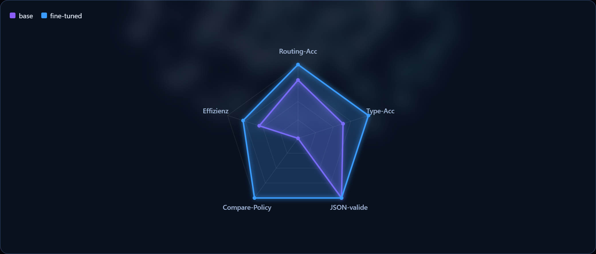
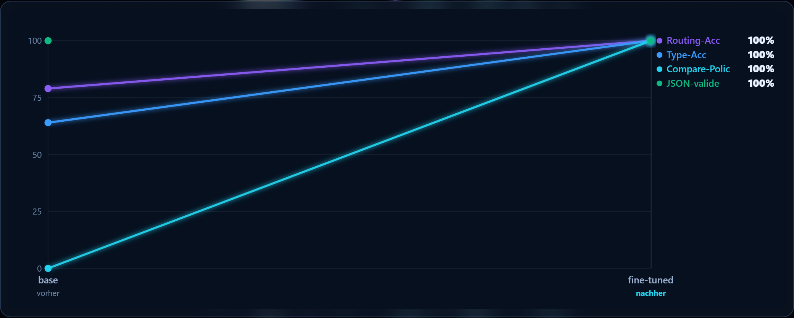
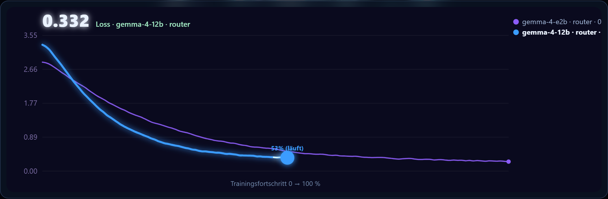
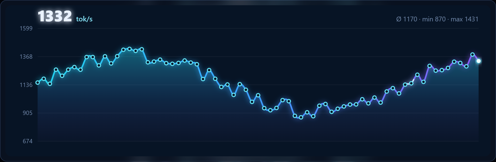
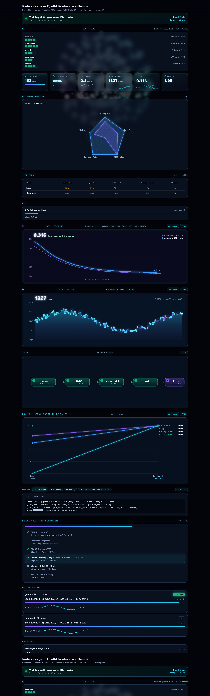
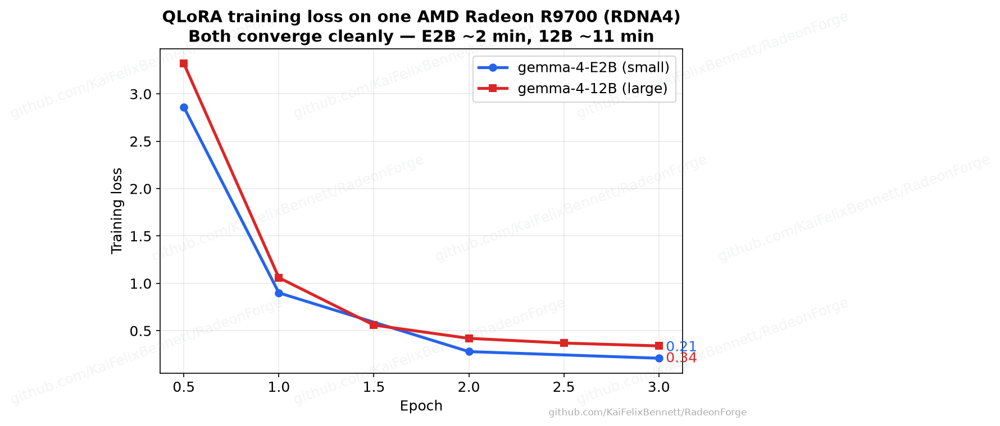
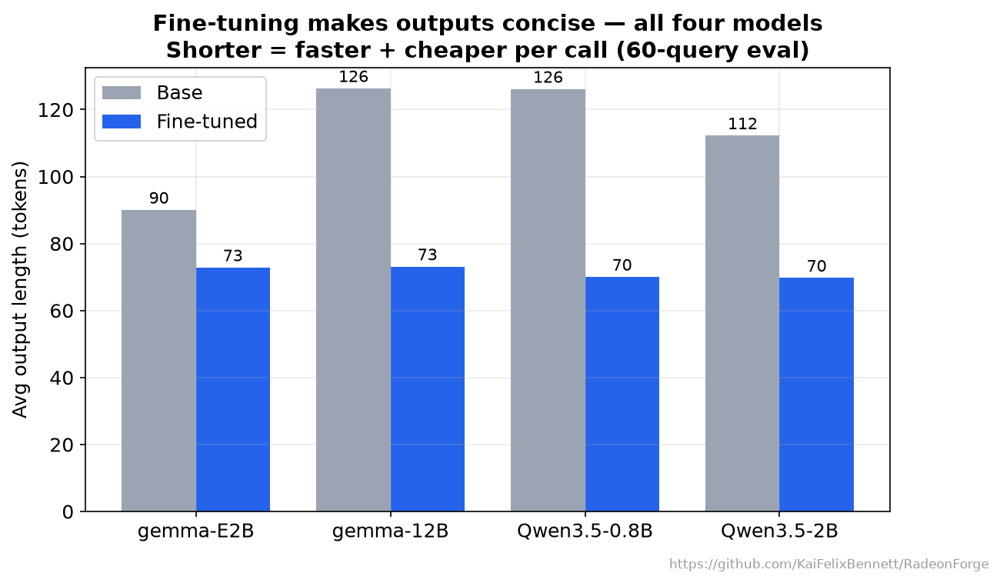

<div align="center">


<br>

[](VERSIONS.md)
[](docs/track-a-wsl2-rocm.md)
[](docs/paths-and-stability.md)
[](RUNBOOK.md)
[](LICENSE)
[](CONTRIBUTING.md)
[](https://github.com/KaiFelixBennett/RadeonForge/stargazers)

**Fine-tune LLMs on AMD Radeon (RDNA4 / RDNA3) under Windows & WSL2 — reproducibly.**

QLoRA via ROCm · a worked Gemma-4 example · a live training dashboard · and a smoke test that *proves the loss actually falls* on your box before you commit hours.

📖 [**Reproduce it (RUNBOOK)**](RUNBOOK.md) · 🔁 [**Reuse for your model**](docs/reuse-your-own-model.md) · 🩺 [**gfx1201 traps → fixes**](docs/troubleshooting.md) · 🧠 [**How fine-tuning works**](docs/how-finetuning-works.md)

</div>

---

## ⚡ See it train — `make demo` (no GPU required)

<div align="center">


</div>

The dashboard ships with a **brand-neutral live demo** that simulates a training run, so you
can see the whole thing move in ~10 seconds with **zero hardware and zero install** (pure
Python stdlib):

```bash
make demo                       # → opens http://127.0.0.1:8765/gl
# or, with no make:
python scripts/demo_dashboard.py --open
# or on Windows, double-click:  start_dashboard.bat
```

It's the same engine you'd point at a real run — 3D WebGL background, live loss & tokens/s
charts, a base-vs-fine-tuned **radar fingerprint**, a pass/fail eval grid, a data-driven
roadmap, and GPU telemetry. One file, no CDN, works offline, reusable in any project.

<div align="center">




</div>

<details>
<summary><b>The full <code>/gl</code> dashboard (one screenshot)</b></summary>

<div align="center"></div>
</details>

---

## ✅ The proof — same prompt, only the weights differ

A falling loss is necessary but not sufficient. Here's the **controlled A/B** on held-out
data for the worked example (a query-complexity router), measured on **one** AMD Radeon AI
PRO R9700:

<div align="center">


</div>

| | Before (base) | After (fine-tuned) |
|---|---|---|
| **Routing accuracy** (14 held-out) | 79 % | **100 %** |
| Query-type accuracy | 64 % | **100 %** |
| Avg output length | 88 tok | **71 tok (−19 %)** |
| Served speed (Q4_K_M, R9700) | — | **~117 tok/s** |

The full pipeline — **dataset → QLoRA → merge → GGUF → GPU serving** — is proven end to end,
and **scales to the 12B** on the same card (~11 min to train, 6.9 GB Q4_K_M, ~53 tok/s,
86 % → 93 %). Every number is reproducible from raw A/B JSON via
[`make_charts.py`](examples/gemma4-12b-qlora/make_charts.py) — no hand-typed figures. Full
evidence: [**PILOT_REPORT.md**](PILOT_REPORT.md).

<div align="center"></div>

---

## 🤔 Why this exists

Fine-tuning an LLM on an **AMD consumer/workstation GPU under Windows** is, as of 2026, still
a yak-shave. Official AMD tutorials assume datacenter Instinct (MI300X) on Linux; consumer
**RDNA** is "supported" at the runtime layer, but the *training* stack (bitsandbytes,
FlashAttention, paged optimizers) breaks in undocumented, arch-specific ways. The knowledge
that makes it work is scattered across forum posts, GitHub issues, and one-off blogs.

RadeonForge packages **one pinned, tested path** for the exact intersection that is genuinely
unmet:

> **discrete RDNA4 (RX 9070 / Radeon AI PRO R9700, `gfx1201`) + Windows/WSL2 + reproducible QLoRA/LoRA + a Gemma-4 example + a smoke test.**

It is deliberately *not* "yet another ROCm wrapper" — the general case (Linux/Instinct, or
APUs) is already covered by [Unsloth](https://unsloth.ai),
[LLaMA-Factory](https://github.com/hiyouga/LLaMA-Factory), and
[kyuz0/amd-strix-halo-llm-finetuning](https://github.com/kyuz0/amd-strix-halo-llm-finetuning).
The value here is the **Windows/WSL2 + discrete-RDNA4 glue** and the **honest, dated workarounds**.

---

## 🧭 The honest hardware / OS matrix (June 2026)

| Platform | Inference | **Training (fine-tune)** |
|---|---|---|
| **Native Windows + ROCm** | ✅ preview | ❌ **No ML training** (AMD: *"No ML training support"*) |
| **Native Windows + Vulkan** | ✅ (often fastest on RDNA4) | ❌ no backward-pass kernel upstream |
| **WSL2 + ROCm** | ✅ | ✅ **QLoRA/LoRA** — start here on Windows |
| **Native Linux + ROCm** | ✅ | ✅ **most stable — long-term home** |

**Takeaway: train on ROCm, not Vulkan.** On Windows today → **WSL2 + ROCm** (you're likely
90 % there). For a serious rig → **native Linux + ROCm**. Vulkan is the *inference* path
(great on RDNA4) but **cannot train**. Full reasoning + evidence:
[docs/paths-and-stability.md](docs/paths-and-stability.md).

---

## 🚀 Quickstart (Track A · WSL2 + ROCm)

```bash
git clone https://github.com/KaiFelixBennett/RadeonForge && cd RadeonForge

# 0. (inside WSL2) bootstrap the env — handles the librocdxg + bnb + Triton traps for you
make setup                       # idempotent; pinned, dated stack (see VERSIONS.md)

# 1. prove training actually works on THIS box BEFORE committing hours
make smoke                       # 50-step 4-bit QLoRA; FAILS loudly on loss→0 / NaN

# 2. run the worked Gemma-4 example
make train                       # QLoRA, RDNA4 workarounds baked in

# 3. merge LoRA → GGUF (Q4_K_M) for local llama.cpp serving
bash examples/gemma4-12b-qlora/export_gguf.sh
```

No `make`? Every target maps to one command — see the [Makefile](Makefile) or the
step-by-step [**RUNBOOK**](RUNBOOK.md). New to fine-tuning? Start with
[docs/how-finetuning-works.md](docs/how-finetuning-works.md).

> **Philosophy — the smoke test is the real reproducibility guarantee.** Pinned versions rot
> fast on this hardware. RadeonForge's durable promise is **not** a version list — it's
> [`scripts/smoke_test.py`](scripts/smoke_test.py): a 50-step run that **fails loudly** if your
> environment hits a known silent-corruption trap. Run it first, every time, before a long job.

---

## 🪤 The two load-bearing gfx1201 workarounds (baked into every config here)

1. **Never use paged optimizers.** `paged_adamw_*` / `adamw_bnb_8bit` **silently corrupt**
   training on gfx1201 (loss→0, grad_norm→NaN after step 1). Use `optim="adamw_torch"`.
   *(NF4 4-bit weight quant itself is fine — only the **paged** optimizer is broken.)*
2. **Use math SDPA attention.** FlashAttention doesn't compile for gfx1201, and AOTriton
   flash/mem-efficient SDPA crash during training. Disable both SDP backends and load with
   `attn_implementation="sdpa"`.

The full symptom → fix table is in [docs/troubleshooting.md](docs/troubleshooting.md). These
are exactly the traps `make smoke` catches in 60 seconds.

---

## 📊 Results, in depth

<div align="center">


</div>

<details>
<summary><b>More charts — the policy insight, the efficiency frontier, throughput</b></summary>

<div align="center">




</div>

All 13 charts are generated from the raw A/B JSON (`make charts`), so they can't drift from
the measured numbers. See [charts/](charts/) and [PILOT_REPORT.md](PILOT_REPORT.md).
</details>

---

## 🔁 Reuse it for your own model & dataset

The whole stack is **project-agnostic**. To retarget it you change **3 things** — the dataset
(a chat JSONL), the config (`model_id` + paths), and the dashboard manifest — and keep the
gfx1201 workarounds. The dashboard knows nothing about any specific model; it just reads files.

➡️ [**docs/reuse-your-own-model.md**](docs/reuse-your-own-model.md) — the 10-minute path from
clone to *my model, my data, my live dashboard*. Schemas in [scripts/DASHBOARD.md](scripts/DASHBOARD.md).

---

## 🗂️ Repo layout

```
RadeonForge/
├─ README.md                 ← you are here
├─ RUNBOOK.md                ← reproduce the pilot end-to-end (blank Ubuntu → served model)
├─ PILOT_REPORT.md           ← every measured result, in one place (the evidence file)
├─ VERSIONS.md               ← pinned, dated version matrix (perishable — re-verify)
├─ Makefile · setup.sh       ← one-command setup / demo / smoke / train / charts / assets
├─ docs/                     ← Track A/B setup, gemma-4 notes, troubleshooting, reuse guide
├─ scripts/
│  ├─ doctor.sh              ← environment health check
│  ├─ smoke_test.py          ← "does the loss actually fall?" sanity run
│  ├─ progress_dashboard.py  ← the reusable live dashboard engine (stdlib only)
│  └─ demo_dashboard.py      ← the no-GPU live demo (seeds data + simulates a run)
├─ examples/gemma4-12b-qlora/← the worked example: trainer, config, eval, export, charts
└─ charts/ · assets/         ← generated result charts · README visuals (regen: make assets)
```

---

## 🧪 Tested on

- **GPU:** AMD Radeon AI PRO R9700 (RDNA4, `gfx1201`, 32 GB)
- **OS:** Windows 11 + WSL2 (Ubuntu 24.04) — Track A · native Windows — inference only
- **Stack:** ROCm 7.2 · PyTorch 2.9.1+rocm7.2.0 · transformers 5.x · bitsandbytes preview
- **Verified:** June 2026 (see [VERSIONS.md](VERSIONS.md))

> Expected to work on RX 9070 / 9070 XT (gfx1201) and, with arch flags changed, RDNA3
> (gfx1100, e.g. RX 7900 XTX) — **not yet tested there.** Got it working on another card?
> A [hardware report](../../issues/new/choose) or a dated [VERSIONS.md](VERSIONS.md) PR is the
> single most valuable contribution here.

---

## 🤝 Contributing

This is meant to be handed to the community. The most valuable contribution is a **dated**
report of a stack that works (or doesn't) — *a version entry without a date is worse than
none.* See [CONTRIBUTING.md](CONTRIBUTING.md). Be honest about what *didn't* change after
fine-tuning; that's what makes the wins credible.

## 🙏 Credits & sources

Built on the shoulders of AMD ROCm, PyTorch-ROCm,
[bitsandbytes](https://github.com/bitsandbytes-foundation/bitsandbytes),
[Hugging Face TRL/PEFT](https://github.com/huggingface/trl), and
[llama.cpp](https://github.com/ggml-org/llama.cpp). Field reports behind the gfx1201
workarounds are cited in [docs/troubleshooting.md](docs/troubleshooting.md).

## 📄 License

[MIT](LICENSE) — use it, fork it, ship it.

<div align="center"><sub>If RadeonForge saved you a weekend of yak-shaving, a ⭐ helps others find it.</sub></div>
